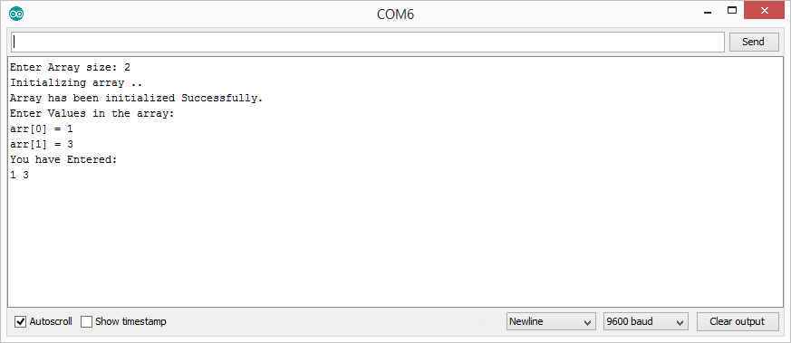
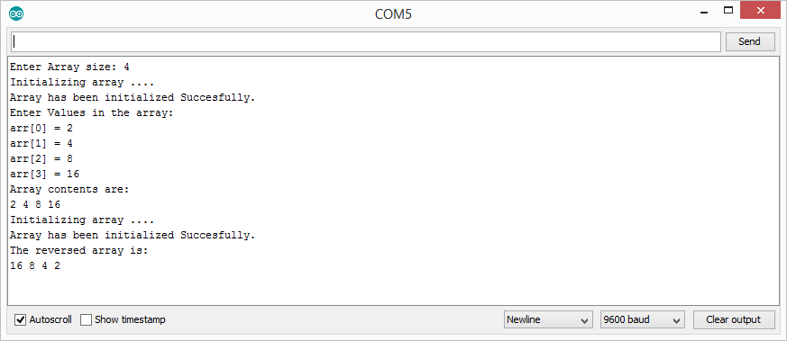

# Lab 00 (Arduino Basics)

Aim of the lab was to test Arduino programming and using the Arduino IDE. It tested our basic C programming and taking input and giving output to the user using the serial monitor. We had to use new methods for input and output from the Serial class.
This lab consists of three parts LabTask1, LabTask2 and LabTask3.

# Lab Tasks

## LabTask1:
In Task1, we took the size of an array and its elements from the user. Then, the program should display the elements of array by iterating over the array.

    

## LabTask2:
Task2 was same as Task1, the only difference was that we had to create functions for input processing (size & elements of array) and output (displaying elements of the array) to make the code more readable and manageable.

    

## LabTask3:
In Task3, we used the same functions as defined in Task2, the only addition was to make a function which would reverse the array and then display its elements.

    

# References
- https://www.arduino.cc/reference/en/language/functions/communication/serial/println/
- https://www.arduino.cc/en/Serial.ParseInt
- https://arduino.stackexchange.com/questions/48526/serial-parseint-value-always-goes-back-to-0
