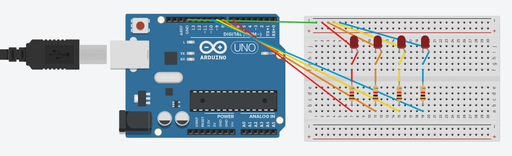

# Lab 01 (LEDs Basics)

After the revision of the basic concepts of programming arduino for LEDs, this lab was supposed to evaluate us by writing a program in Arduino in such a way so that LEDs (connected to Arduino) would glow in a required sequence.
This lab consists of two parts LabTask1 and LabTask2.

# Circuit Diagram

    

# Lab Tasks

## LabTask1:
Task1 was to glow 4 LEDs connected in a sequence in such a way that our program should make the LEDs glow in a chasing sequence, then blink 3-times and then glow out in reversed chasing sequence and this process should run infinitely.

## LabTask2:
Task2 was to prompt user for his/her name and then it should make the LEDs glow as many times as there are characters (except the spaces) present in the prompted name/string.

# References
- https://www.arduino.cc/reference/en/language/variables/data-types/stringobject/
- https://www.arduino.cc/en/Tutorial/StringLength
- https://www.arduino.cc/reference/en/language/functions/communication/serial/available/
- https://www.arduino.cc/reference/en/language/variables/data-types/string/functions/charat/
