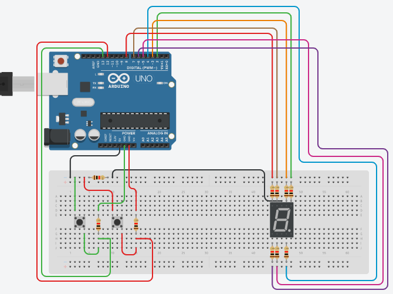

# Lab 02 (7 Segment Counter with Push Buttons)

The aim of the lab was to test our skills in dealing with 7-segment and pushbuttons. It tested our coding skills, basically our logic in dealing with pushbuttons, in addition to a 7-segment and combining them in the sense of circuitry and coding.
This lab consists of only one LabTask.

# Circuit Diagram

    

# Lab Tasks

## LabTask:
In this LabTask, we had to connect a 7-segment display with Arduino and connected each segment with an Arduino pin through resistors. We also attached 2 pushbuttons to the Arduino. Finally, after completing the whole circuit, we had to write code so that one push button counts up while the other one counts down and we also had to take care of switch debounce through our code.

# References
- https://www.arduino.cc/reference/en/language/functions/communication/serial/println/
- https://www.arduino.cc/en/tutorial/pushbutton
- https://www.allaboutcircuits.com/projects/interface-a-seven-segment-display-to-an-arduino/
- https://www.tinkercad.com
