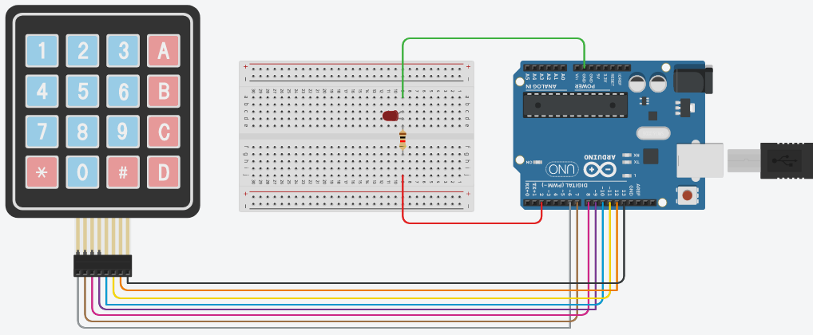
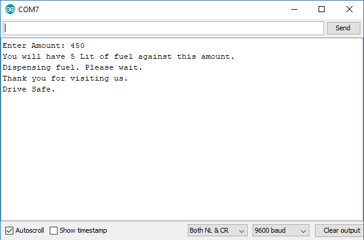
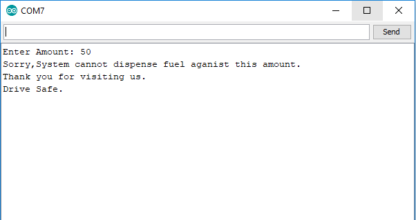

# Lab 03 (Arduino Programming with Keypad)

The aim of the lab was to test our skills in dealing with a 4x4 keypad. It tested our coding skills, basically our logic in dealing with user input through keypad, processing it and displaying meaningful information.
This lab consists of only one LabTask.

# Circuit Diagram

    

# Lab Tasks

## LabTask:
In this LabTask, we had to use the Keypad library to interface with the keypad. On startup, we had to make an LED blink twice to indicate that the gas station terminal has started. Then, take 2 to 4 digits from the user through keypad with the submit button as the ‘#’ symbol. We converted the input string to integer and calculated total liters according to the given rate (Rs. 90 per liter). We display the total liters and wait for the number of total liters (delay).

    

    

# References
- https://www.arduino.cc/reference/en/language/functions/communication/serial/println/
- https://learn.adafruit.com/adafruit-arduino-lesson-2-leds/blinking-the-led
- https://playground.arduino.cc/code/keypad/
- https://www.arduino.cc/reference/en/language/variables/data-types/string/functions/concat/
- https://www.arduino.cc/en/Tutorial.StringToIntExample
- https://www.tinkercad.com
