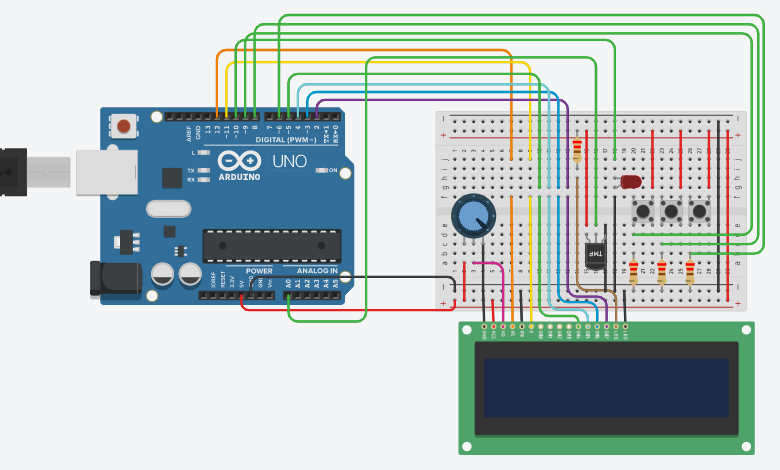

# Lab 04 (Chemical Factory Dryer Simulation)

The aim of the lab was to test our skills in dealing with an LCD & LM35DZ interfacing with Arduino. It tested our coding skills, basically our logic in dealing with user input through buttons, processing it and displaying meaningful information on the LCD.
This lab consists of only one LabTask.

# Circuit Diagram

    

# Lab Tasks

## LabTask:
In this LabTask, we had to use the LiquidCrystal library to interface with the LCD. On startup, we had to display a meaningful prompt on the LCD. Then the user would enter a number representing temperature in Celsius which should be between 20 and 80oC with the help of 2 push buttons, one for tens digit and one for units digit. After that, the user submits the temperature by pushing the submit button. If the entered temperature is greater than the temperature read by the LM35DZ, then the LED will light up, otherwise, the LED stays off.

# References
- https://www.arduino.cc/reference/en/language/functions/communication/serial/println/
- https://learn.adafruit.com/adafruit-arduino-lesson-2-leds/blinking-the-led
- https://www.instructables.com/id/Interfacing-20x4-LCD-with-Arduino/
- https://www.instructables.com/id/Arduino-Temperature-Sensor-Using-LM35/
- https://www.arduino.cc/reference/en/language/variables/data-types/string/functions/concat/
- https://www.arduino.cc/en/Tutorial.StringToIntExample
- https://www.tinkercad.com
