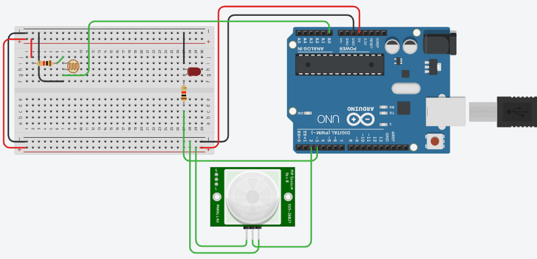

# Lab 05 (Staircase Light Control System)

The aim of the lab was to test our skills in dealing with an LDR & PIR Motion Sensor and interfacing them with Arduino. It tested our coding skills, basically our logic in dealing with the value returned by LDR and using it to control an LED.
This lab consists of only one LabTask.

# Circuit Diagram:

    

# Lab Tasks

## LabTask:
In this LabTask, we had to detect motion using the PIR Motion Sensor, then based on the ambient light sensed by the LDR, our code decides whether to turn on the LED (representing a light fixture). If it’s dark and motion is detected, then the LED remains on for at least 30 seconds. It remains on for 30 seconds more if motion is detected during this period. If no motion is sensed, the code turns the LED off.

# References
- https://www.arduino.cc/reference/en/language/functions/communication/serial/println/
- https://learn.adafruit.com/adafruit-arduino-lesson-2-leds/blinking-the-led
- https://maker.pro/arduino/tutorial/how-to-use-an-ldr-sensor-with-arduino
- https://randomnerdtutorials.com/arduino-with-pir-motion-sensor/
- https://www.tinkercad.com
