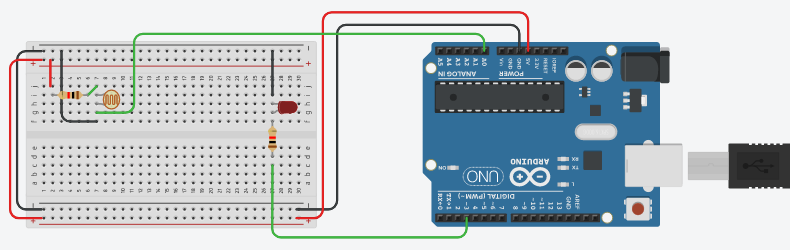
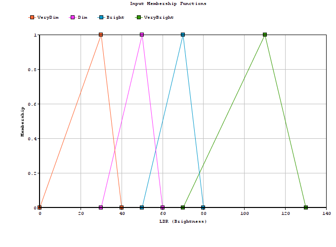
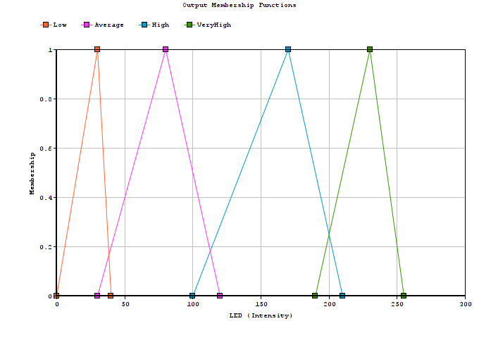

# Lab 06 (Controlling LED with Fuzzy Logic)

The aim of the lab was to test our skills in understanding the sample code of FuzzyLogic that is provided with the library. It also tested our skills in making linguistic variables for the input (Brightness) as well as the output (Intensity of LED). Moreover, we also made the membership functions and the rule base for the given problem.
This lab consists of two LabTasks.

# Circuit Diagram

    

# Lab Tasks

## LabTask1:
In this LabTask, we had to download the embedded fuzzy logic library (eFLL), open the sample code of FuzzyLogic, understand it and answer various questions that were mentioned on the Lab handout.

## LabTask2:
In this LabTask, we had to set up a circuit that consisted of an LDR and an LED interfaced with Arduino. We had to change the sample code provided with the library so that the LED should glow with a very low (or zero) intensity, if light falling on LDR is very bright. The LED should glow with high intensity if there is no light falling on LDR that is complete dark. So, we had to design the fuzzy controller with appropriate linguistic variables and define the membership functions.

# Membership Functions:

## Brightness

    

## Intensity

    

# Rule Base
1.	if Brightness == VeryDim then Intensity = VeryHigh
2.	if Brightness == Dim then Intensity = High
3.	if Brightness == Bright then Intensity = Average
4.	if Brightness == VeryBright then Intensity = Low

# References
- https://www.arduino.cc/reference/en/language/functions/communication/serial/println/
- https://blog.zerokol.com/2012/09/arduinofuzzy-fuzzy-library-for-arduino.html
- https://create.arduino.cc/projecthub/yqmt8708/how-to-control-led-brightness-539d5b
- https://www.tinkercad.com/
- https://www.onlinecharttool.com/
