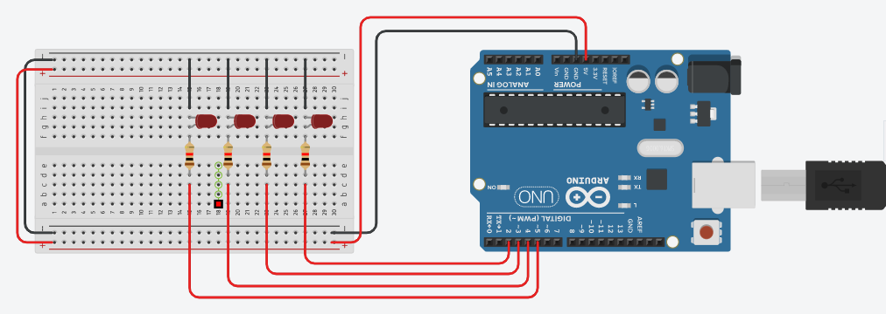

# Lab 07 (LED Arduino Library)

The aim of the lab was to test our skills in creating a library that can work with variable number of LEDs.
This lab consists of only one LabTask.

# Circuit Diagram:

    

# Lab Tasks

## LabTask:
In this LabTask, we had to create a library. We made a .h file (declaration) and a .cpp (definition). In the header file, we declared the class, methods and attributes. We had to make various functions such as upCount, downCount, shiftLeft, shiftRight and allOff.

# References
- https://learn.adafruit.com/adafruit-arduino-lesson-2-leds/blinking-the-led
- http://blog.industrialshields.com/en/how-to-calculate-the-value-raised-to-a-power-with-arduino-ide/
- http://www.multiwingspan.co.uk/arduino.php?page=led5
- https://www.tinkercad.com
