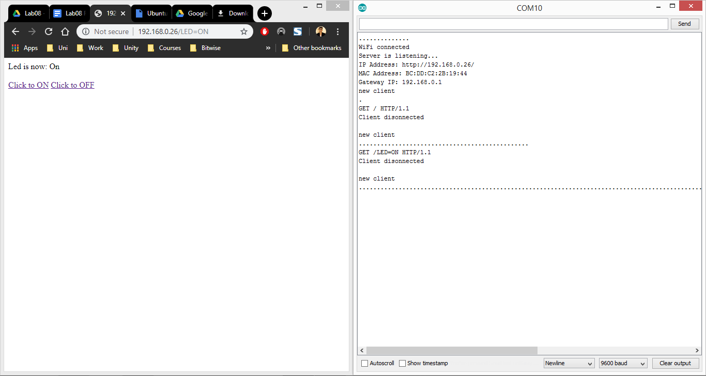

# Lab 08 (Node MCU)

The aim of the lab was to test our skills in dealing with a Node MCU. We had to display some information related to the connectivity. Make the node mcu work as a server, accept a client’s request and generate a response. In the final task, we modified the previous code so that the page displays a drop down list and a button to handle the request of the user of blinking an LED n times.
This lab consists of three LabTasks.

# Circuit Diagram

    

# Lab Tasks

## LabTask1:
In this LabTask, we had to use the ESP8266WiFi library. We connected the Node MCU to a WLAN, display the connectivity information (IP Address, MAC Address, Gateway IP) on the serial monitor.

    

## LabTask2:
In this LabTask, we make our Node MCU work as a server, made it handle a request from a browser of the client and generate an appropriate response.

    

## LabTask3:
In this LabTask, we connected an LED with our Node MCU and made it work as a server. Displayed a drop-down list and a submit button for the client to select a number from 1 to 9 which corresponds to the number of times the LED is to be blinked.

    

# References
- https://www.arduino.cc/reference/en/language/functions/communication/serial/println/
- https://techtutorialsx.com/2017/04/09/esp8266-get-mac-address/
- https://stackoverflow.com/questions/39252057/get-gateway-address-in-arduino-using-esp8266
- https://www.w3schools.com/html/html_forms.asp
- https://www.w3schools.com/tags/tag_select.asp
- https://circuits4you.com/2019/03/20/esp8266-receive-post-get-request-data-from-website/
- https://learn.adafruit.com/adafruit-arduino-lesson-2-leds/blinking-the-led
- https://www.arduino.cc/en/Tutorial.StringToIntExample
- https://fritzing.org/
