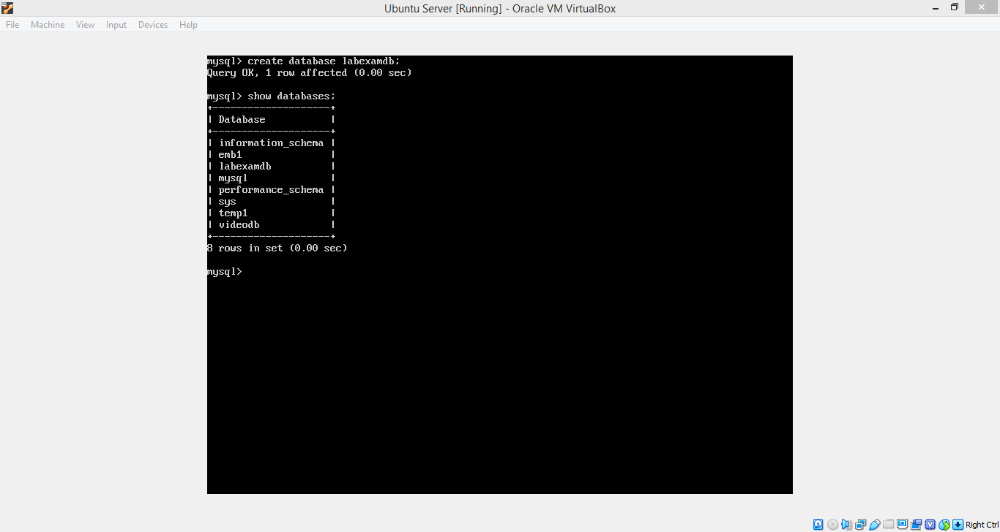
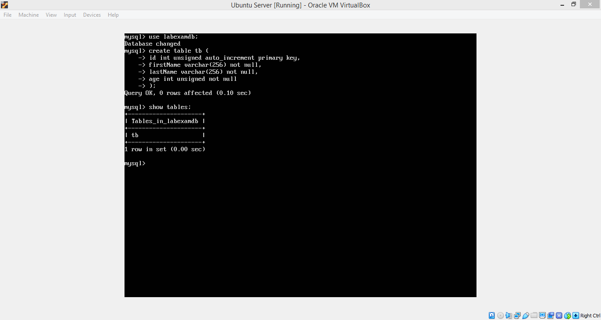
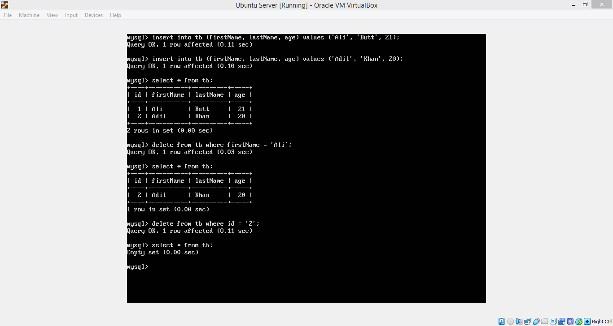

# Lab 09 (Ubuntu Server CRUD)

The aim of the lab was to test our skills in dealing with Ubuntu Server machine and connecting it with another Linux Machine, both running on VirtualBox.
This lab consists of three LabTasks.

# Lab Tasks

## LabTask1:
In this LabTask, we created a database on Mysql server installed on the Ubuntu Server machine and created a table that had 4 fields (id, firstName, lastName, age). Then, we inserted and deleted records from the table using different insert and delete queries.

    

    

    

## LabTask2:
In this LabTask, we created three php files (insert.php, delte.php, update.php) and placed them in /var/www/html directory in the Ubuntu Server machine. We added and deleted records by forming the appropriate links on the address bar of a web browser. We had to use the same database and table created in LabTask1.

    

    

    

    

## LabTask3:
In this LabTask, we created a simple html page containing three text boxes for First Name, Last Name, Age and an Insert button. On click of Insert button, the information entered on the fields is stored in the table created in LabTask1. We also added html code for handling the deletion of records. The html code contains one field for entering First Name and a Delete button. On click of Delete button, the record with the same First Name as entered by the user is deleted.

    

    

    

    

    

# References
- https://www.w3schools.com/PHP/php_mysql_select.asp
- https://www.w3schools.com/PHP/php_mysql_create_table.asp
- https://www.w3schools.com/PHP/php_mysql_insert.asp
- https://www.w3schools.com/PHP/php_mysql_delete.asp
- https://www.w3schools.com/PHP/php_mysql_update.asp
- https://www.w3schools.com/php/php_forms.asp
